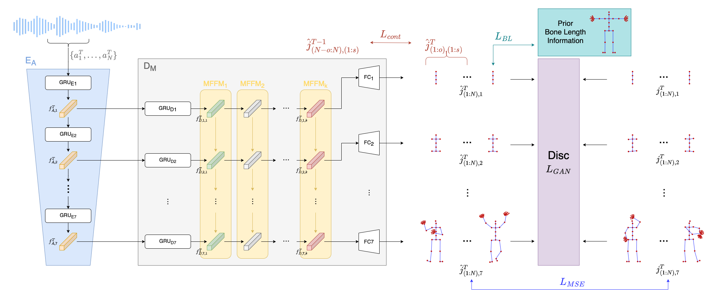

# Proximal Distral Gesture Generation 

Official implementation of paper 'PDGG: Co-speech Whole Body Gesture Generation Extending from Proximal to Distal'.  Link will be updated when published. 



## Environments 

- python = 3.7

## Prepare 

### Install Packages 

```
pip install -r requirements.txt
```

### Install Pytorch 

Search and install pytorch version 1.6 in [official page](https://pytorch.org/get-started/locally/)

### Pre-processing 

0. Download Trinity dataset in [link](https://trinityspeechgesture.scss.tcd.ie/) 
1. Make sure speech(wav) and motion(bvh) file pair to have same name 
2. Organize data folder like below 

``` 
data_folder 
├── audio
│   ├── file1.wav
│   ├── file2.wav
│   ├── ...
│   └── fileN.wav
└── motion
    ├── file1.bvh
    ├── file2.bvh
    ├── ...
    └── fileN.bvh
```

3. Run preprocessing code 

```
python misc/preprocessing.py --data_folder folder/path/organized/above/process \
                             --save_folder dataset \
                             --train \
                             --silence_path misc/silence.wav
```

- data_folder : Origin folder path that contains audio and motion folders. 
- save_folder : Target results folder path. 
- train : Given or not. if given, make folder named 'train' and save results. Else processed files are saved in 'test' folder 
- silence_path : Path to silence wav file in misc folder. 

We also provide mean pose from all frames in Trinity train dataset in dataset folder (`hierarchyMean.bvh`, `hierarchyMean.npy`). If change save_folder argments value, copy that files and paste them to target location you gave. 

After run 'train' and 'test' case and put *Mean files, processed folder organized as below. 

X means network input, preprocessed wav file, and Y means output of networks, preprocessed bvh motion file. 

```
save_folder 
 ├── train
 │   ├── ..._X.npy
 │   ├── ..._Y.npy
 │   └── ...
 ├── test 
 │   ├── ..._X.npy
 │   ├── ..._Y.npy
 │   └── ...
 ├── hierarchy.npy 
 ├── hierarchy.bvh 
 ├── silence.npy  
 ├── hierarchyMean.npy 
 └── hierarchyMean.bvh 
```

## Make Configurations 

As mentioned in paper, our model generates motion based on human's joint cofigurations(roles and shapes). We provide pre-designed paper version configs(typeA~typeG) in configs folder. 

In addition, you can also make your own configs by modifying list value named `steps` in file `misc/makeConfigs.py`. Make sure change `suffix` value in case of overwriting configs files. 

## Train 

```
python train.py --results_path results/folder/path \
                --config target/config/path \
                --train_data_folder dataset/train \
                --silence_npy_path dataset/silence.npy \
                --hierarchy_npy_path dataset/hierarchyMean.npy
```

During training, middle point save file will be saved in sub-folder under `results_path`. Other argments can be handled by changing their values. 

Pre-trained weight and meta-data used for reconstruct PDGG networks will be open soon. 


## Inference 

```
python inference.py --input_wav path/to/inference/target/wav/file \
                    --trained_model_folder trained/results/folder/path 
```

- input_wav : Wav format audio file. 
- trained_model_folder : Folder that contains trained .ckpt and args.txt file. This folder is generated from `results_path` argment in train process. 
- input_motion : Motion bvh or numpy file paired to input_wav file. If given, GT movements presented on left side of generated mp4 file. 

## Evaluate 

WIP 