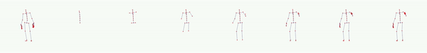

# Proximal Distral Gesture Generation 

Official implementation of paper 'PDGG: Co-speech Whole Body Gesture Generation Extending from Proximal to Distal'.  Link will be updated when published. 


## Environments 

- python = 3.7

## Prepare 

### Install Packages 

```
pip install -r requirements.txt
```

### Install Pytorch 

Search and install pytorch version 1.6 in [official page](https://pytorch.org/get-started/locally/)

### Pre-processing 

0. Download Trinity dataset in [link](https://trinityspeechgesture.scss.tcd.ie/) 
1. Make sure speech(wav) and motion(bvh) file pair to have same name 
2. Organize data folder like below 

``` 
data_folder 
├── audio
│   ├── file1.wav
│   ├── file2.wav
│   ├── ...
│   └── fileN.wav
└── motion
    ├── file1.bvh
    ├── file2.bvh
    ├── ...
    └── fileN.bvh
```

3. Run preprocessing code 

```
python misc/preprocessing.py --data_folder folder/path/organized/above/process \
                             --save_folder dataset \
                             --train \
                             --silence_path misc/silence.wav
```

- data_folder : Origin folder path that contains audio and motion folders. 
- save_folder : Target results folder path. 
- train : Given or not. if given, make folder named 'train' and save results. Else processed files are saved in 'test' folder 
- silence_path : Path to silence wav file in misc folder. 

We also provide mean pose from all frames in Trinity train dataset in dataset folder (`hierarchyMean.bvh`, `hierarchyMean.npy`). If change save_folder argments value, copy that files and paste them to target location you gave. 

After run 'train' and 'test' case and put *Mean files, processed folder organized as below. 

X means network input, preprocessed wav file, and Y means output of networks, preprocessed bvh motion file. 

```
save_folder 
 ├── train
 │   ├── ..._X.npy
 │   ├── ..._Y.npy
 │   └── ...
 ├── test 
 │   ├── ..._X.npy
 │   ├── ..._Y.npy
 │   └── ...
 ├── hierarchy.npy 
 ├── hierarchy.bvh 
 ├── silence.npy  
 ├── hierarchyMean.npy 
 └── hierarchyMean.bvh 
```

## Make Configurations 

As mentioned in paper, our model generates motion based on human's joint cofigurations(roles and shapes). We provide pre-designed paper version configs(typeA~typeG) in configs folder. 

In addition, you can also make your own configs by modifying list value named `steps` in file `misc/makeConfigs.py`. Make sure change `suffix` value in case of overwriting configs files. 

## Train 

```
python train.py --results_path results/folder/path \
                --config target/config/path \
                --train_data_folder dataset/train \
                --silence_npy_path dataset/silence.npy \
                --hierarchy_npy_path dataset/hierarchyMean.npy
```

During training, middle point save file will be saved in sub-folder under `results_path`. Other argments can be handled by changing their values. 

Pre-trained weight and meta-data used for reconstruct PDGG networks will be open soon. 

### Pre-trained Weight 

We provide paper version pre-trained model weight in [here](https://drive.google.com/file/d/15qp8apU0VeuXI9dx2RUmQ99rDxtyz2W0/view?usp=share_link). After download and unzip, you can find argument file(.txt) and trained weight file(.ckpt). Place them in one folder and use the folder path as the input arguments for inference and evaluate. 


## Inference 

```
python inference.py --input_wav path/to/inference/target/wav/file \
                    --trained_model_folder trained/results/folder/path 
```

- input_wav : Wav format audio file. 
- trained_model_folder : Folder that contains trained .ckpt and args.txt file. This folder is generated from `results_path` argment in train process. 
- input_motion : Motion bvh or numpy file paired to input_wav file. If given, GT movements presented on left side of generated mp4 file. 

After inference process finished, you can find results in `trained_model_folder`. Front rendered video(.mp4) of skeleton character's motion and its keypoint coordinates numpy file(.npy) are generated. Below is the example of infered mp4 video result from default train setting. 

<p align="center">
  
</p>


## Evaluate 

```
python evaluation.py --gt_motion_folder dataset/test \
                     --audio_folder test/input/folder/path \
                     --model_folder_path trained/results/folder/path/ \
                     --eval_net_path misc/gesture_autoencoder_checkpoint_best.bin
```

- gt_motion_folder : Pre-processed test dataset folder path.
- audio_folder : Folder path that contains raw wav form input audio files.
- model_folder_path : Trained model folder path. That is `trained_model_folder` in Train process. 
- eval_net_path : Trained FGD evaluate model weight file path. please download [here](https://drive.google.com/file/d/1t_E625IkgbV7a5Otg_hsxQTQM9Y_YzdG/view?usp=sharing) and place in `misc` folder. 

Evaluation results are shown as below. The values are from paper version pre-trained weights. 

```
                  | BBC Ve | BBC Li | BBC Ha | FGD fr | FGD fe
-----------------------------------------------------------------
 [TestSeq002.wav] | 0.6428 | 0.6834 | 0.6393 | 4.4202 | 22.0714
 [TestSeq005.wav] | 0.6977 | 0.6894 | 0.6543 | 8.2500 | 25.7936
 [TestSeq003.wav] | 0.6540 | 0.6915 | 0.6208 | 7.2891 | 22.3243
 [TestSeq009.wav] | 0.6708 | 0.6801 | 0.7195 | 5.8487 | 24.9839
 [TestSeq004.wav] | 0.6814 | 0.6975 | 0.6443 | 6.6568 | 26.0809
 [TestSeq006.wav] | 0.6330 | 0.6272 | 0.6219 | 4.4166 | 23.9573
 [TestSeq008.wav] | 0.6545 | 0.6939 | 0.6736 | 5.9093 | 22.0128
 [TestSeq001.wav] | 0.6489 | 0.6716 | 0.6267 | 4.2002 | 24.3621
 [TestSeq007.wav] | 0.6179 | 0.6334 | 0.6622 | 8.0222 | 26.0221
 [TestSeq010.wav] | 0.5809 | 0.6223 | 0.5786 | 9.8179 | 22.9384
-----------------------------------------------------------------
     Average      | 0.6482 | 0.6690 | 0.6441 | 6.4831 | 24.0547
```


